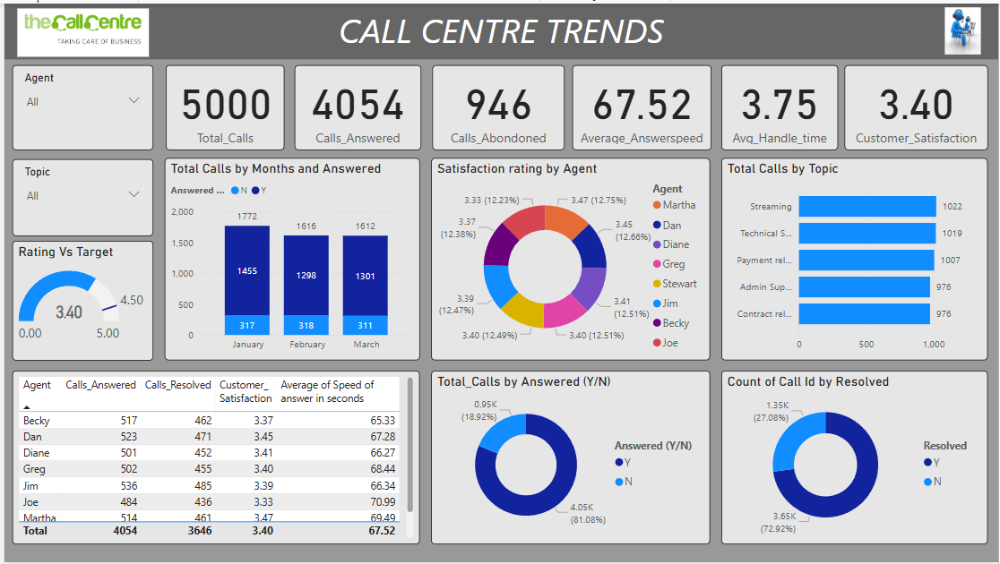
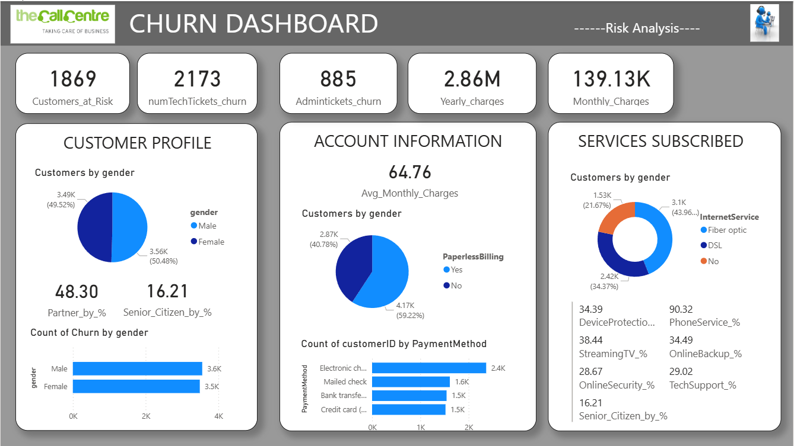
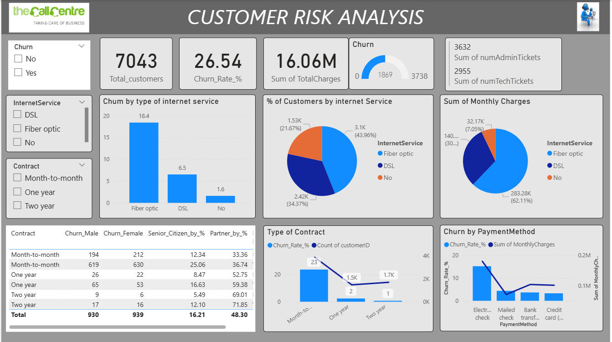

# PwC Power BI Virtual Experience (Power BI)

## Overview
Three-dashboard Power BI report built on PwC's telecom dataset,
analysing the same data from three different business perspectives —
operations, retention, and risk. Each dashboard answers a different
stakeholder question from the same underlying source.

## Tools Used
Power BI · DAX · Power Query

---

## Call Centre Trends

The call centre had no structured way to measure agent performance
or identify why customer satisfaction was falling. With 5,000 calls
across three months and seven agents handling varying workloads,
leadership needed clarity on who was performing, where calls were
being lost, and what topics were driving volume.

The dashboard was built to give the call centre manager a single
view of all operational KPIs — filterable by agent and topic —
with a monthly trend to track volume shifts over time.

| Metric | Value |
|---|---|
| Total calls | 5,000 |
| Calls answered | 4,054 (81.08%) |
| Calls abandoned | 946 (18.92%) |
| Average answer speed | 67.52 seconds |
| Customer satisfaction | 3.40 / 5.00 |
| Satisfaction target | 4.50 / 5.00 |

Satisfaction is sitting 24% below the 4.50 target — the most
critical finding in the dataset. The agent breakdown reveals why:

| Agent | Calls Answered | Resolved | Satisfaction | Avg Speed (s) |
|---|---|---|---|---|
| Jim | 536 | 485 | 3.39 | 66.34 |
| Dan | 523 | 471 | 3.45 | 67.28 |
| Becky | 517 | 462 | 3.37 | 65.33 |
| Martha | 514 | 461 | 3.47 | 69.49 |
| Greg | 502 | 455 | 3.40 | 68.44 |
| Diane | 501 | 452 | 3.41 | 66.27 |
| Joe | 484 | 436 | 3.33 | 70.99 |

Jim handles the highest call volume (536) with the best resolution
rate — the most efficient agent overall. Martha delivers the highest
satisfaction score (3.47) despite not being the fastest to answer,
suggesting quality of resolution matters more than speed of pickup.

Joe presents the clearest coaching opportunity — slowest answer
speed at 70.99 seconds and the lowest satisfaction rating at 3.33.

January was the busiest month at 1,772 calls with the highest
abandonment, pointing to a potential understaffing issue at peak
periods. Streaming (1,022) and Technical Support (1,019) are the
two dominant call topics — the natural focus areas for agent
training investment.

---

## Churn Analysis

With 26.54% of 7,043 customers churning, the retention team needed
to understand who was leaving and why — not just the headline
number but the demographic and behavioural profile underneath it.

The dashboard segments churned customers across gender, senior
citizen status, partner status, payment method, internet service
type, and contract type to build a clear picture of the at-risk
customer profile.

| Metric | Value |
|---|---|
| Customers at risk | 1,869 |
| Tech tickets from churned customers | 2,173 |
| Admin tickets from churned customers | 885 |
| Yearly revenue at risk | $2.86M |
| Monthly revenue at risk | $139.13K |
| Average monthly charge per churned customer | $64.76 |

Churn splits almost perfectly by gender — 50.48% female vs 49.52%
male — making gender an unreliable predictor for retention targeting.

The more telling patterns are in payment and service behaviour.
59.22% of churned customers use paperless billing, and fiber optic
customers represent the largest churned segment at 43.96% — the
premium service tier is losing customers at the highest rate.

Senior citizens make up 16.21% of churned customers, a
disproportionately high share relative to their overall presence
in the customer base. Electronic check is the dominant payment
method among churned customers at 2.4K — a potential friction
point worth investigating in the payment experience.

---

## Customer Risk Analysis

Understanding who churned was only half the picture. The bigger
business question was where the highest revenue risk sat and which
segments needed immediate retention intervention to protect $16.06M
in total charges.

The risk dashboard quantifies churn rate by internet service type,
contract type, and payment method — giving finance and customer
experience leadership a prioritised view of where to act first.

| Metric | Value |
|---|---|
| Total customers | 7,043 |
| Overall churn rate | 26.54% |
| Total charges at risk | $16.06M |
| Total admin tickets | 3,632 |
| Total tech tickets | 2,955 |

Fiber optic carries the highest churn rate at 18.4%, compared to
DSL at 6.5% — the premium tier is significantly less stable despite
commanding higher monthly charges. This points to a service quality
or expectation gap rather than a pricing issue.

Contract type is the strongest churn predictor in the dataset.
Month-to-month customers churn at 23%, dropping sharply to 2% on
one-year contracts and 1% on two-year contracts. Customers on
two-year contracts show a 71.85% partner rate — long-term commitment
correlates strongly with life stability indicators.

The combination of month-to-month contract and senior citizen status
presents the highest risk profile in the dataset — 25.06% churn rate
with a 36.74% partner rate, suggesting this group lacks both the
contractual lock-in and the household stability that predict retention.

Electronic check payment method consistently correlates with the
highest churn rate across all segments — a friction point that
could be addressed through payment method migration campaigns
before customers reach the exit.
